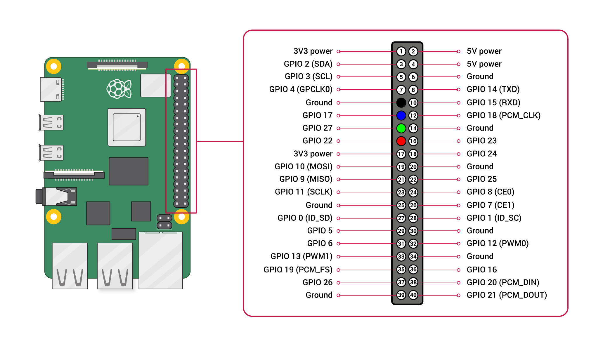

# Setup a Raspberry Pi
## Setup the image
For setting up the image see the official docs: [Installation Guide](https://www.raspberrypi.org/documentation/installation/installing-images/)

### Via official Raspberry Pi Imager
When using the Raspberry Pi Imager, you can set the default user & password, (eg. `pi`/`raspberry`), enable ssh by default
and provide the credentials for a Wi-fi connection.

### Manually
Alternatively, you can flash the image via `dd`:
```shell
xzcat ~/2024-03-15-raspios-bookworm-arm64-lite.img.xz | sudo dd of=/dev/mmcblk0 bs=4M conv=fsync status=progress
```
After flashing, mount the boot partition of the sd card and edit/create the following files:  
_cmdline.txt_
```text
console=serial0,115200 console=tty1 root=PARTUUID=fb33757d-02 rootfstype=ext4 fsck.repair=yes rootwait quiet init=/usr/lib/raspberrypi-sys-mods/firstboot cfg80211.ieee80211_regdom=DE systemd.run=/boot/firstrun.sh systemd.run_success_action=reboot systemd.unit=kernel-command-line.target
```
_firstrun.sh_
```shell
#!/bin/bash

set +e

/usr/lib/raspberrypi-sys-mods/imager_custom set_hostname pi101
/usr/lib/raspberrypi-sys-mods/imager_custom enable_ssh
/usr/lib/userconf-pi/userconf 'pi' '$5$9GtZOfSgQG$eiECao0ftt4ggx2TNrD61rdLVJ/Zes1ps/mNWBhM.E4'
/usr/lib/raspberrypi-sys-mods/imager_custom set_keymap 'de'
/usr/lib/raspberrypi-sys-mods/imager_custom set_timezone 'Europe/Berlin'

# wpa_passphrase 'MySSID' 'FooBar' | grep 'psk=' | grep -v '#psk' | cut -d= -f2
#/usr/lib/raspberrypi-sys-mods/imager_custom set_wlan 'MySSID' 'passhash' 'DE'

rm -f /boot/firstrun.sh
sed -i 's| systemd.run.*||g' /boot/cmdline.txt
exit 0
```

### Older Os Version
Older version of the Raspi Os used to have a default user & password (`pi`/`raspberry`). And you could enable the ssh 
daemon by creating a `ssh` file in the root directory of the sd card before booting the first time.

```shell
sudo dd if=/home/philipp/Downloads/2023-05-03-raspios-bullseye-armhf-lite.img of=/dev/mmcblk0 bs=4M conv=fsync status=progress
# mount boot partition
touch ssh
# if no password is set by default, use:
echo "pi:$(echo 'raspberry' | openssl passwd -6 -stdin)" > userconf
# an attempt to provide more power via the USB ports:
echo 'max_usb_current=1' > config.txt
```

#### Setup Wireless Network
Add the following lines to the `/etc/wpa_supplicant/wpa_supplicant.conf` file and change the ssid and psk accordingly:

```
network={
    ssid="myWifiSsid"
    psk="myWifiPassword"
}
```
and run the following commands:
```
wpa_cli
   interface wlan0
   reconfigure
   quit
```

More information about the Pi network configuration can be found in the 
[official docs](https://www.raspberrypi.org/documentation/configuration/wireless/wireless-cli.md).

#### Setup Ethernet Network
The Raspberry Pi should be connected to the router via ethernet. In order to get the GameController data, the
Raspberry Pi has to be in the "10.0.x.x/16" subnet. Also make sure, there's no other device with the same IP!  

The `ìnstall.sh` script can set up a static ip. Alternately use this  [guide](https://www.modmypi.com/blog/how-to-give-your-raspberry-pi-a-static-ip-address-update).

#### Keyboard layout
Changing the keyboard layout on the raspberry:
https://raspberrypi.stackexchange.com/questions/24161/change-keyboard-layout-in-console

## Setup the LEDs
This image shows where the colored wires have to go on the GPIO  pins:  
